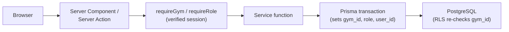

# GymPilot Architecture

A technical overview for reviewers — what GymPilot is, how it's built, and the engineering decisions behind it. For the full internal design rationale, see `docs/architecture.md` and `docs/decisions.md`.

## Overview

GymPilot is a multi-tenant SaaS application for gym owners — members, memberships, payments, attendance, trainers, expenses, analytics, and an AI assistant, all scoped per gym. It's a single Next.js application (App Router, TypeScript) with PostgreSQL (via Supabase) as the only datastore. There's no microservice split, message queue, or background job system — nothing in the product's scope needs that infrastructure, and adding it would be complexity without a corresponding requirement.

## System Architecture

Every request follows one path: **page or Server Action → service function → Prisma → PostgreSQL**. An ESLint rule enforces this structurally — only files under `lib/server/services/` are allowed to import the Prisma client at all. That means tenant scoping and business rules live in exactly one place per entity, not re-implemented (and potentially re-broken) on every screen that touches it.

```
app/                    Routes (Server Components + Server Actions)
  platform/              Platform Admin area
  gym/[gymId]/           Gym Admin / Gym Staff area — every route here is tenant-scoped
  api/ai/                 The one streaming endpoint (Server Actions can't stream)
lib/
  server/
    db.ts                 Prisma client + the RLS transaction helpers (see below)
    auth.ts                Session/role resolution — requireGym()/requireRole()
    services/               All business logic. The only place allowed to import Prisma.
      metrics.ts             Canonical calculations — one definition per figure, reused everywhere
  ai/                      AI provider, tool definitions, system prompt
components/               UI, mostly Server Components; Client Components only where interactivity requires it (nav toggle, confirm dialogs, the chat UI)
prisma/                  Schema + migrations (including hand-authored RLS policies)
tests/                   unit / integration / isolation / ai-evals / e2e
```

Most pages are Server Components that call a service function directly during render — there's no separate internal REST/GraphQL layer for ordinary CRUD. Mutations go through Server Actions (form submissions handled server-side, no client-side fetch boilerplate). The one exception is the AI assistant, which needs a real streaming HTTP response, so it's the app's only Route Handler.

## Request & Data Flow

Two things happen before any business query runs: the session is resolved and verified server-side (`requireGym()`/`requireRole()` in `lib/server/auth.ts`, using Supabase's `getUser()` — which re-verifies the token against Supabase, unlike `getSession()`, which just trusts a cookie), and every service-layer call opens one Postgres transaction that sets three transaction-local settings before running the real query:



That second box in the transaction is deliberate: the service function already filters by `gymId` explicitly in its query, and the database re-checks the same boundary independently via Row-Level Security. Neither layer depends on the other being correct.

## Multi-Tenant Security

Every tenant-owned table carries a `gym_id` column (shared-schema multi-tenancy — one database, not one schema or database per gym, which would multiply migration and connection-management overhead the project's scale doesn't need). Isolation is enforced twice, independently:

1. **Application layer.** Every service function receives a server-verified `{ userId, gymId, role }` and includes `gymId` in every query's `WHERE` clause. There is no code path where a client-supplied `gymId` is trusted.
2. **Database layer — Row-Level Security (RLS).** RLS is a PostgreSQL feature that attaches a row-visibility policy directly to a table, evaluated by the database on every query regardless of which application code issued it. Every tenant table has RLS both `ENABLE`d and — importantly — `FORCE`d. Without `FORCE`, a table's *owner* role bypasses RLS entirely, which would make the policy silently inert if the app connected as the owning role.

That's why the application never connects as the owning role. It connects as **`app_user`**, a dedicated database role created specifically for this purpose: `NOBYPASSRLS`, not the owner of any table it queries, and granted only the specific `SELECT`/`INSERT`/`UPDATE` (or narrower) privileges each table actually needs. Schema migrations run under a separate, more privileged owner role — `app_user` never runs DDL. This split means that even a bug that skips the application-layer `gymId` filter still can't leak another tenant's rows, because the database itself won't return them to a role with `app_user`'s restrictions.

This isn't just asserted — it's independently tested. `tests/isolation/` runs raw SQL directly against `app_user` (no application code involved at all) and confirms every table's cross-tenant access is actually blocked at the database, not just by convention.

## Roles & Authorization

Role-based access control (RBAC) — permissions attached to a fixed role rather than configured per-user — with three roles:

| Role | Scope | Can | Cannot |
|---|---|---|---|
| Platform Admin | Global, no gym | Create/suspend/reactivate gyms | Read or write any gym's operational data by default — no built-in bypass |
| Gym Admin | One gym | Everything in their gym: members, plans, memberships, payments (incl. void/adjust), attendance, trainers, expenses, analytics, AI assistant, staff logins | Access another gym's data |
| Gym Staff | One gym | Members, membership assign/renew/freeze, record payments, attendance check-in | Plans, trainers, expenses, analytics, AI assistant, voiding/adjusting payments, staff management |

Each restriction is enforced at up to three independent layers: a `requireRole()` guard on the Server Action itself, an RLS policy on the underlying table, and — for the areas fully closed to Gym Staff (trainers, expenses, analytics, AI) — no database grant at all for that role, so the restriction holds even if a Server Action guard were ever missed.

## Data Integrity

A recurring pattern in this codebase: an application-layer check exists for a fast, friendly error message, but the database constraint is the actual, final authority — because a "check, then act" sequence in application code is never atomic against a second concurrent request doing the same thing at the same time.

| Guarantee | Application check | Database enforcement |
|---|---|---|
| Payments/expenses are append-only | Service layer exposes no update/delete function | No `UPDATE`/`DELETE` grant exists on those tables at all — mutation is impossible, not just unused |
| One phone number per gym | Pre-check before insert | Unique index on `(gym_id, phone_normalized)` |
| No overlapping memberships per member | Status-based pre-check before assigning | PostgreSQL `EXCLUDE` constraint on date-range overlap (excluding cancelled memberships) — this is strictly stronger than the app check, since it also catches a backdated assignment onto an already-expired-but-not-cancelled membership, which the status check alone would miss |
| One check-in per member per day | Pre-check before insert | Unique index on `(gym_id, member_id, date(checked_in_at))` |

For the three constraints above (phone, memberships, attendance), the service layer catches the specific Postgres error a race produces and re-throws the same typed error the pre-check would have thrown, so a caller never sees a difference between "caught early" and "caught by the database." This is covered by tests that fire genuinely concurrent requests and assert exactly one succeeds.

Membership status (active / expiring soon / expired / frozen / cancelled) is computed at query time from stored dates, never stored in a column kept fresh by a background job — so there's exactly one implementation of "what counts as active," used identically by the dashboard, analytics, and the AI tools.

## AI Assistant

The assistant (Anthropic Claude via the Vercel AI SDK) never computes a business number itself — it narrates numbers a fixed set of read-only tools return. Each tool is a thin wrapper around an already-tested service function; there is no "run arbitrary SQL" tool and no write-capable tool of any kind.

- **Gym-scoped by construction.** The session's `gymId` is resolved server-side and closed over by every tool before the model is ever invoked. No tool's input schema has a `gymId` field, so there's no parameter for a prompt-injection attempt to redirect — the tool implementation only ever queries the one gym the server already resolved.
- **Read-only boundary.** The tool module imports only read-oriented service functions; the capability to mutate data is structurally absent from that file, not merely unused.
- **Structured inputs.** Each tool declares a typed (Zod) input schema — most take no arguments at all; the one that does (`getDashboardSummary`) accepts an enum (`"this-month" | "last-month"`), not free text.
- **Usage-limited.** A per-gym daily counter caps how many requests a gym can make, checked before the model is invoked.

A separate concern from "does each tool return correct data" (covered by ordinary service-layer tests) is "does the model actually pick the right tool for a realistic question." That's what the opt-in **tool-selection evaluation suite** (`tests/ai-evals/`) checks: it sends real gym-owner-style questions through the real model, using the real system prompt and tool definitions, and asserts on which tool got called and with what arguments — including cases where two tools sound superficially similar but only one is correct. It's excluded from normal test runs and CI (it costs real API calls), and skips itself automatically unless an API key is present.

## Testing & Quality

| Layer | What it proves | Runs against |
|---|---|---|
| Unit (`npm test`) | Pure business-rule logic — status derivation, revenue/attendance math, validation | No database |
| Integration (`npm run test:db`) | Service-layer correctness, including concurrency tests that fire simultaneous requests and assert a race resolves to exactly one row | Real PostgreSQL |
| Isolation (`npm run test:db`) | Cross-tenant access is blocked at the database itself, via raw SQL with no application code involved | Real PostgreSQL, as the actual `app_user` role |
| AI tool-selection eval (`npm run test:ai-eval`, opt-in) | The real model routes realistic questions to the correct tool/arguments | Real Anthropic API |

CI (GitHub Actions) runs lint, typecheck, the unit suite, and a build on every push, plus a second job that runs the full integration/isolation suite against a real `postgres:16` service container — so the tenant-isolation guarantees above are checked on every push, not just locally.

## Deployment

Vercel hosts the Next.js application; Supabase provides the PostgreSQL database and Auth. The `prebuild` step runs `prisma generate` before every build (Prisma 7 has no bundled query engine or automatic postinstall hook, so this has to be explicit).

There is currently one Supabase environment — used for both local development and the live deployment linked from the README. There is no separate Production Supabase project or Production Vercel environment at this time; the live deployment is a working Preview build on the existing development infrastructure, not a claim of production-grade environment separation. Database migrations are applied explicitly via the Prisma CLI, using a direct (non-pooled) connection under the migration-owner role — never `app_user`, and never run automatically on application boot.

## Key Engineering Decisions

| Decision | Why |
|---|---|
| Shared-schema multi-tenancy + RLS, not schema/database-per-tenant | The standard, proven pattern at this scale; per-tenant infrastructure would add real operational cost for isolation RLS already provides |
| Membership/attendance status computed at read time, never stored + cron-updated | Removes a class of "stale status" bugs and an entire piece of scheduler infrastructure; guarantees one definition of each metric |
| Prisma 7 with a raw `pg` driver adapter | Prisma 7 ships no bundled engine — the driver adapter is a required, explicit choice, not an optional optimization |
| Tool-calling over RAG for the AI assistant | The product's AI questions are structured, computable queries over relational data, not document retrieval — a vector database would be infrastructure without a matching requirement |
| Database constraints behind every app-layer race-sensitive check | An application "check, then write" is never atomic against a second concurrent request; the constraint is the actual guarantee, the app check is just a friendlier error message |
| A real-model AI eval suite, kept opt-in rather than mocking the model | Mocking the model's own decision would only prove the test harness works, not that the system prompt and tool schemas actually produce correct routing — but a live model call isn't free or fully deterministic, so it's deliberately excluded from CI |
